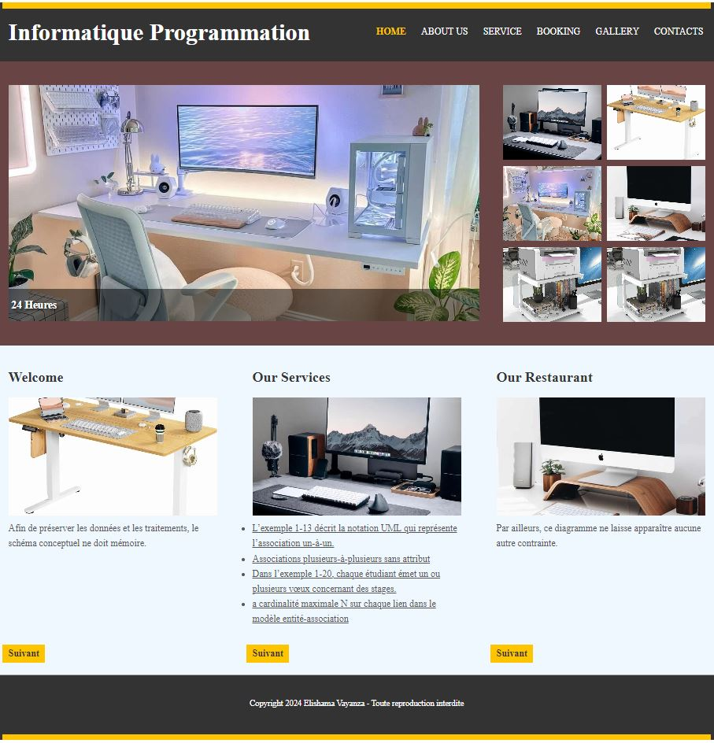

# CITE 

Un explorateur de fichiers intuitif et puissant, permettant de naviguer, visualiser et gérer les fichiers et dossiers sur votre appareil ou  vos périphériques connectés.

## Fonctionnalités

- Presentation

## Prérequis

- HTML and CSS
- I VS code

## Installation

1. Clonez le dépôt : git@github.com:elishamavayanza/cite.git

## Captures d'ecran

## Auteurs
- [ELISHAMA VAYANZA](https://github.com/elishamavayanza) - Etudiant en Génie Informatique

